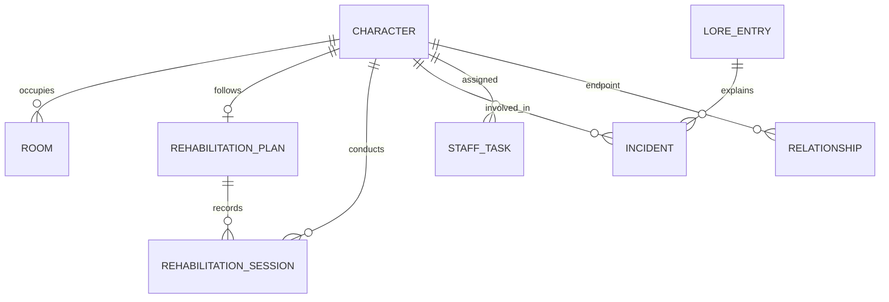

# Data model

`src/types/index.ts` defines the model and `src/db/localDb.ts` is the runtime repository. State is serialized as one validated `DatabaseState` object in browser storage. There is no Prisma or SQLite runtime.

## Aggregate state

| Section | Purpose | Important references |
| --- | --- | --- |
| `characters` | Canon identity plus simulation status | `rank` is separate from species; optional timeline projections never mutate the save |
| `rooms` | Capacity, occupants, restrictions, damage | `occupantIds` references characters; legacy `occupantId` is retained as the primary occupant |
| `rehabilitationPlans` | Goals and four progress scores | One plan per tracked character |
| `rehabilitationSessions` | Immutable progression history | `planId` references a plan; `conductedBy` references staff |
| `incidents` | Security, damage, trust and reputation effects | Character IDs and optional lore link |
| `staffTasks` | Delayed operational work and workload | `assignedTo` references staff; completion effects are applied once |
| `reputation` | Seven global pressure/credibility meters | Values are clamped to 0–100 |
| `timeline` | Active scope and spoiler filter | View/filter state only; it does not rewrite character records |
| `loreCodex` | Source-labelled facts and notes | Locked official entries cannot be edited or deleted through the repository |
| `factions` | Simulation influence | Values are clamped to 0–100 |
| `relationships` | Pairwise social/contract links | Both endpoints reference characters |
| `resourceLedger` | Income and expenses | Amounts are positive; type carries the direction |
| `auditLogs` | Administrative history | Timestamped records; users may purge history without deleting gameplay safeguards |
| `settings` | Name, random events and theme | Includes the high-contrast theme option |
| `gameplayMeta` | Durable campaign control state | Day, cooldowns, fatigue, counters and exactly-once milestone IDs |

Inventory (`h_inv_bar`, `h_inv_clean`, `h_inv_food`) is kept in separate local keys, with a capacity of 50 per category. Database and inventory mutations that belong to one gameplay action are committed atomically. Schema-v3 exports include every aggregate section, inventory and durable `gameplayMeta` in the same backup envelope.

## Referential rules

- Character deletion cascades through rooms, plans, sessions, incidents, tasks and relationships.
- Deleting a session cannot silently reverse previously applied progress, and redemptions or other one-time rewards remain guarded outside the purgeable audit log.
- A character cannot occupy multiple rooms, and room capacity/restrictions are enforced before assignment.
- Schema-v3 import rejects missing required sections/structures, duplicate IDs, missing references, invalid enum-like values, non-finite numbers and unsupported future versions. Migration defaults are limited to unversioned/version-1/version-2 payloads.
- Repository writes validate the complete candidate state first. Multi-key gameplay transactions restore both database and inventory if any persistence step fails.
- Timeline/spoiler mutations and their audit record use one repository transaction, so neither can persist without the other.

## Storage failure and recovery

The repository exposes whether storage is persistent or session-only and reports read/write failures to the Settings alert. Missing inventory keys initialize to documented seed values, but malformed counters and storage access errors are surfaced rather than silently treated as valid stock. Before migrating or replacing invalid local database data, the repository preserves the untouched raw string in up to five browser recovery slots. Raw snapshots are downloadable without validation; restore still requires full schema and reference validation.

## Relationships

## Cloud persistence

Cloud backup does not normalize these entities into tables. Supabase stores one size-limited JSON snapshot per `(user_id, app_key)`. Owner-only RLS policies protect select, insert, update and delete operations. The versioned migration is the authoritative cloud schema.
