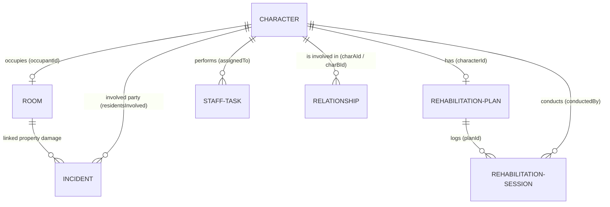

# Database Entity Schema

This document details the local database structures and relationships mapped out in our repository layer (`src/db/localDb.ts` and `src/db/schema.prisma`).

---

## 1. Entity Layout

### Character
Represents a guest, staff member, allied entity, or antagonist in the Pentagram.
- `id` (String, PK): Unique identifier (e.g., `charlie`, `angeldust`).
- `name` (String): Full name.
- `alias` (String): Title or moniker.
- `type` (Enum): Species/origin (`sinner`, `hellborn`, `angel`, `fallen_angel`, `overlord`, `redeemed_soul`, `unknown`).
- `role` (Enum): Operational status (`founder`, `manager`, `resident`, `bartender`, `housekeeper`, `sponsor`, `security`, `antagonist`, `ally`, `external`).
- `status` (Enum): Hotel roster standing (`staff`, `resident`, `applicant`, `banned`, `redeemed`, `external`, `deceased`, `unknown`).
- `riskLevel` (Enum): Hazard categorization (`low`, `medium`, `high`, `catastrophic`).
- `charlieTrust` (Int): Trust score (0 to 100).
- `rehabProgress` (Int): Calculated rehabilitation metric (0 to 100).
- `contracts` (Array of Strings): Diagnostic summary of active deal bindings.
- `notes` (String): Private staff log diagnostics.
- `canonStatus` (Enum): Lore status (`canon`, `semi_canon`, `headcanon`, `user_note`, `unknown`).
- `timelineScope` (Enum): Active season frame.
- `sourceRef` (String): Media citation.
- `spoilerLevel` (Enum): Spoiler level (`none`, `season_1`, `season_2`, `future`).
- `description` (String): Clinical biography.

---

### Room (Ward)
Represents a suite or room in the hotel.
- `number` (String, PK): Ward number (e.g., `101`, `202`).
- `floor` (Int): Hotel floor level.
- `type` (Enum): Room categorization (`standard`, `suite`, `staff_room`, `secured_room`, `damaged_room`, `restricted`).
- `occupantId` (String, Null, FK): References `Character.id`.
- `capacity` (Int): Maximum guest cap.
- `status` (Enum): Sanitary/structural condition (`clean`, `messy`, `damaged`, `cursed`, `under_repair`, `locked`).
- `dangerLevel` (Enum): Danger classification (`low`, `medium`, `high`, `catastrophic`).
- `restrictions` (Array of Strings): Operational constraints (e.g. `no_powers`, `staff_only`).
- `maintenanceNotes` (String): Historical inspection remarks.
- `repairCost` (Float): Budget required to repair structural damage.
- `lastInspectionDate` (String): Date format `YYYY-MM-DD`.
- `lastInspectedBy` (String, Null, FK): References `Character.id` (staff).

---

### RehabilitationPlan
Defines personal goals and moral progress dials for a resident sinner.
- `id` (String, PK): Unique plan identifier.
- `characterId` (String, FK, Unique): References `Character.id`.
- `goals` (Array of Strings): Moral milestones.
- `obstacles` (Array of Strings): External challenges.
- `triggers` (Array of Strings): Relapse triggers.
- `empathyScore` (Int): Compassion level (0 to 100).
- `accountabilityScore` (Int): Historic remorse level (0 to 100).
- `impulseControlScore` (Int): Control level (0 to 100).
- `cooperationScore` (Int): Work ethic rate (0 to 100).
- `charlieNotes` (String): Counseling notebook logs.
- `vaggieNotes` (String): Security compliance log notes.
- `staffPrivateNotes` (String): Diagnostic observations.
- `isRedeemedConfirmed` (Boolean): Verification of ascension.

---

### RehabilitationSession
Records individual counseling, group activities, or bar checks.
- `id` (String, PK): Session log identifier.
- `planId` (String, FK): References `RehabilitationPlan.id`.
- `date` (String): Log date (`YYYY-MM-DD`).
- `type` (Enum): Session category (`empathy_workshop`, `accountability_session`, `therapy_like_checkin`, etc.).
- `summary` (String): Diagnostic session remarks.
- `empathyDelta` (Int): Shift in empathy score.
- `accountabilityDelta` (Int): Shift in accountability score.
- `impulseControlDelta` (Int): Shift in impulse control.
- `cooperationDelta` (Int): Shift in cooperation rate.
- `conductedBy` (String, FK): References `Character.id` (staff).

---

### Incident
Documents security, relapse, or media crises.
- `id` (String, PK): Incident report identifier.
- `date` (String): Date occurred (`YYYY-MM-DD`).
- `location` (String): Incident coordinates.
- `residentsInvolved` (Array of Strings, FK): Lists involved `Character.id` values.
- `type` (Enum): Category (`violence`, `property_damage`, `relapse`, `media_scandal`, etc.).
- `severity` (Enum): Severity status (`low`, `medium`, `high`, `crisis`).
- `summary` (String): Administrative details.
- `consequences` (String): Structural/PR damage details.
- `repairCost` (Float): Cost charged to restore property.
- `reputationImpact` (Int): Deductions applied to hotel standing.
- `trustImpact` (Int): Deductions applied to staff trust.
- `actionTaken` (String): Containment actions.
- `status` (Enum): Roster status (`open`, `contained`, `resolved`, `archived`).
- `loreLink` (String, Null, FK): References `LoreEntry.id` if canonical.
- `tags` (Array of Strings): Search descriptors.

---

### StaffTask
Daily operational scheduler assignments.
- `id` (String, PK): Shift task identifier.
- `date` (String): Scheduled date.
- `title` (String): Task title.
- `type` (Enum): Task type (`room_inspection`, `conflict_resolution`, `perim_defense`, etc.).
- `assignedTo` (String, FK): References `Character.id` (staff).
- `mentalWorkload` (Int): Stress rating (1 to 10).
- `status` (Enum): Roster status (`pending`, `in_progress`, `completed`, `cancelled`).
- `notes` (String): Shift details.

---

### LoreEntry (Codex)
Knowledge base logs explaining canon details.
- `id` (String, PK): Record identifier.
- `title` (String): Record name.
- `entityName` (String): Target character/faction/location.
- `category` (Enum): Category (`location`, `contract`, `world_rule`, `faction`, etc.).
- `description` (String): Verified details.
- `canonStatus` (Enum): Status (`canon`, `semi_canon`, `headcanon`, `user_note`, `unknown`).
- `sourceType` (Enum): Source category (`episode`, `creator_statement`, etc.).
- `sourceRef` (String): Citation.
- `spoilerLevel` (Enum): Spoiler level (`none`, `season_1`, `season_2`, `future`).
- `timelineScope` (Enum): Active season frame.
- `isLocked` (Boolean): Locked status.

---

### Relationship
Demonic deals, social connections, or rivalries.
- `id` (String, PK): Connection identifier.
- `charAId` (String, FK): References `Character.id`.
- `charBId` (String, FK): References `Character.id`.
- `type` (Enum): Link type (`ally`, `romantic`, `family`, `contract_bound`, `manipulative`, `enemy`).
- `notes` (String): Connection details.

---

## 2. Entity Relationships Diagram

